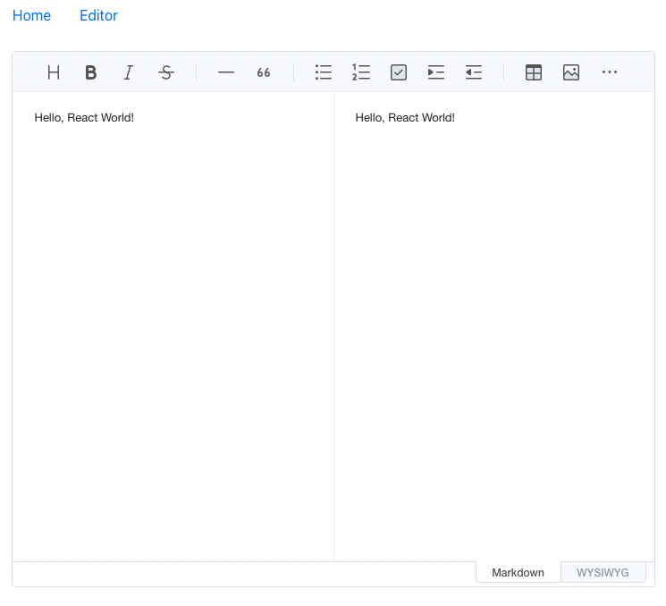

# 토스트에디터 리액트 적용하기 - 1

<br>

> Toast UI Editor를 React에 적용해봅시다.

<br>

**WSYWIG**는 **What You See Is What You Get**의 줄임말로, WSYWIG 에디터는 말 그대로 **작성한 대로 보이는 에디터**입니다. 블로그나 게시판 글 작성에서 흔히 쓰이는, 스타일을 직접 수정하고 글을 작성하는 그런 에디터 말이지요.
<br><br>

본 글은 WSYWIG 에디터 중 한 종류인 Toast UI Editor를 리액트 개발환경에 적용한 기록입니다.
<br><br>

---

## 서론: WYSIWYG 에디터 & Toast UI Editor

프로젝트 중 WSYIWIG 에디터가 필요하게 됐습니다. 그리고 리액트 환경에서의 인기 WSYIWIG 에디터들은 대략 다음과 같은 에디터들이 있는 걸 알게 되었습니다.

<br>

- `Draft Editor`

- `Quill Editor`

- `ckEditor 5`

- `Summer Note`

<br>

그 중 가장 눈에 들어왔던 것은 [Draft Editor](https://jpuri.github.io/react-draft-wysiwyg/#/). 페이스북에서 사용하는 에디터인데, *드래프트 에디터와 React 모두 페이스북에서 만들어졌으니 참으로 찰떡이로다* 라는 리뷰를 보고 Draft Editor를 적용하려 했습니다. 

<br>

그러나 오잉, 생각지도 못했던 문제 발생. 한글 입력 이슈였습니다. 조합형인 한글 특성상, 커서가 아직 작성 중인 한글에 존재하는 데 `Shift` + `Enter`[^주석]를 입력하면, 입력 중이던 내용이 모두 날아가 버리는 것입니다.

`Quill Editor` 역시 마찬가지였고, `ckEditor`의 경우 오픈소스 정책상 문제가 있을 수 있다고 판단해 보류했습니다.

<br>

그러던 중 발견한 `Toast UI Editor`.  "오픈소스 WYSIWIG 에디터, NHN이 개발?  이거면 한글 날아갈 일은 없겠는데?"

한글 환경에서의 가장 안정적인 에디터로 판단했고, 이에 프로젝트에 적용하기로 했죠.

<br>

## Toast UI Editor 적용하기
> Toast UI Editor Github: https://github.com/nhn/tui.editor
>
> 리액트 에디터: https://github.com/nhn/tui.editor/tree/master/apps/react-editor
>
> 에디터 가이드: https://nhn.github.io/tui.editor/latest/

<br>

Toast UI Editor(TUI 에디터)를 리액트 프로젝트에 적용하는 방법은 그렇게 어렵지 않습니다. 한국 공식 가이드를 따라하기만 하면 되니까요.

<br>

먼저 리액트 환경에 에디터를 설치해줍니다. 여기서는 npm을 사용하겠습니다.

```bash
npm install --save @toast-ui/react-editor
```

<br>

이제 TUI 에디터를 불러와줍니다!

<br>

```javascript
import '@toast-ui/editor/dist/toastui-editor.css'
import { Editor } from '@toast-ui/react-editor'
```

<br>

---



몇 가지 옵션 값을 주어 컴포넌트로 만들었습니다. 전체 코드는 다음과 같습니다.

<br>

```javascript
// EditorComponent.js

// Properties 및 API 가이드: https://nhn.github.io/tui.editor/latest/

import React from 'react'

// Toast-ui-Editor
import '@toast-ui/editor/dist/toastui-editor.css'
import { Editor } from '@toast-ui/react-editor'

import "./EditorComponent.scss"

function EditorComponent() {
  return (
    <div className="Editor__Wrapper">
      <Editor
        initialValue="Hello, React World!"	// 초기 입력 문구
        previewStyle="vertical"	// 프리뷰 스타일 ['tab', 'vertical']
        height="600px"	// 에디터 높이값
        initialEditType="markdown"	// 페이지 로드 시 기본 에디터 타입
      />
    </div>
  )
}

export default EditorComponent

```

```scss
// EditorComponent.scss

.Editor__Wrapper {
  width: 720px;
  margin-inline: auto;
}
```

<br>

전체 Properties를 비롯한 API에 대한 설명은 https://nhn.github.io/tui.editor/latest/ 페이지에서 찾아볼 수 있습니다.

<br>

이제 기본적인 사용을 위한 준비가 모두 되었습니다. 다음 글에서는 해당 컴포넌트를 사용해 프로젝트에서 활용했던 내용을 적어보겠습니다.

<br>

<br>

[^주석]: 엔터 입력 시 ```</p><p>```가 자동 생성되어 줄 간격이 너무 넓어져 , 해당 커맨드를 통해 `<p>`를 새로 삽입하지 않고 줄 바꿈이 가능합니다.

